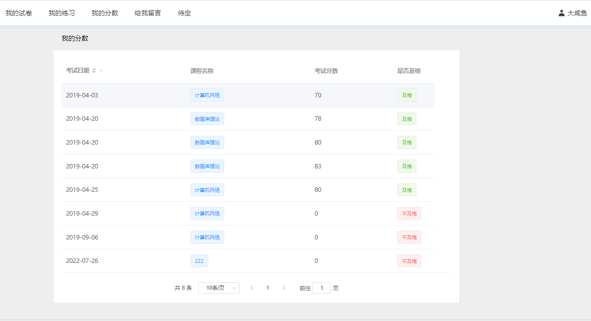
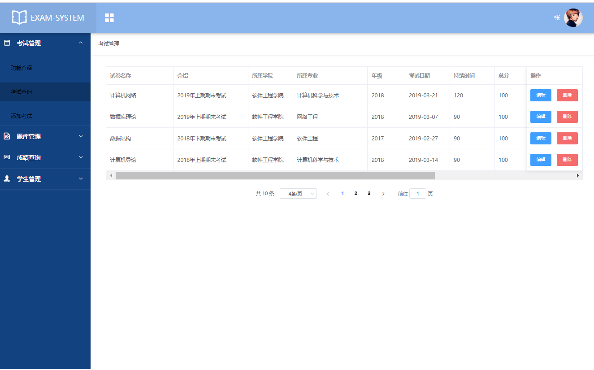
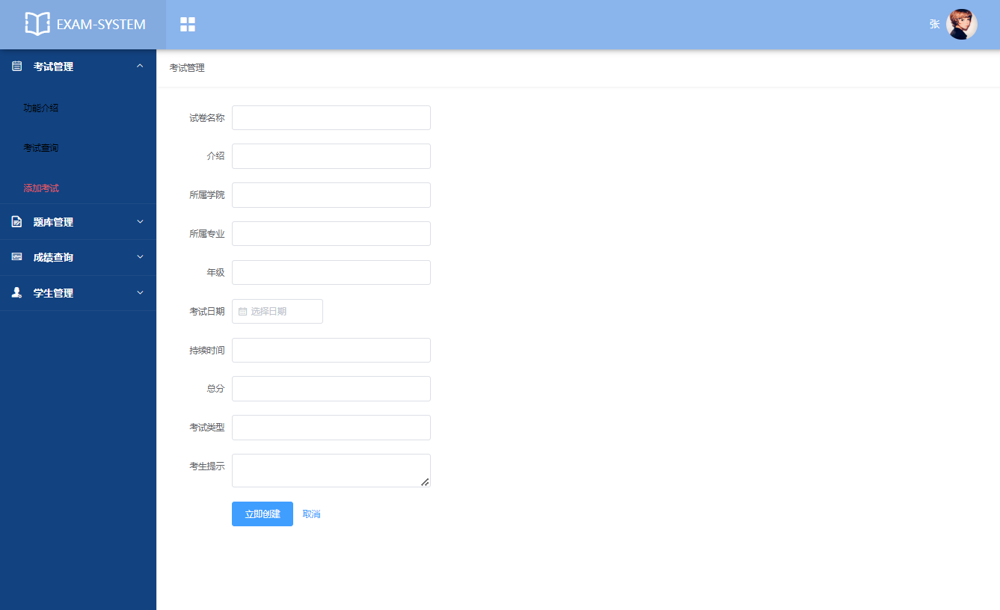
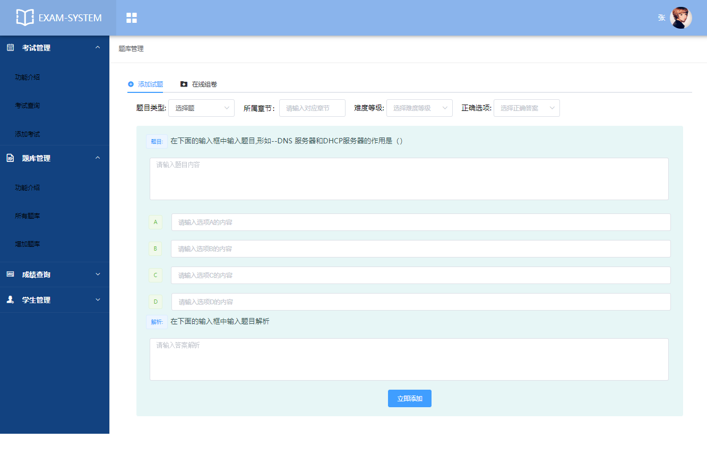
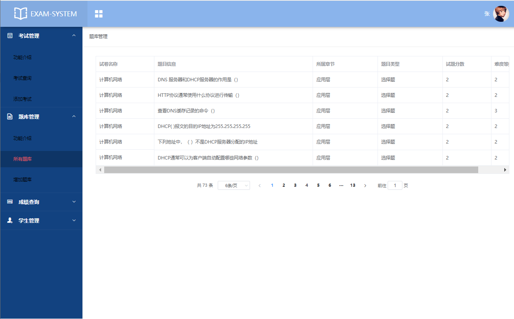
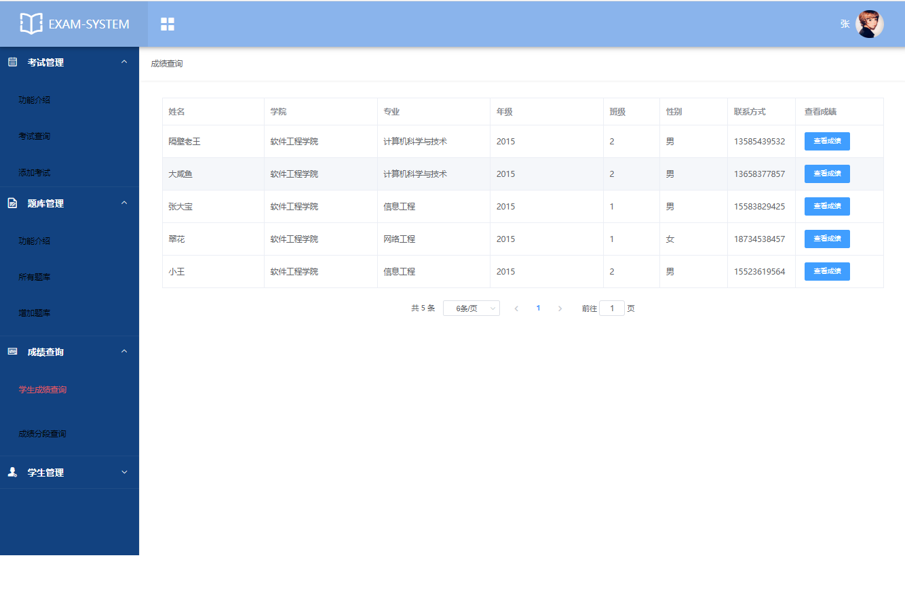
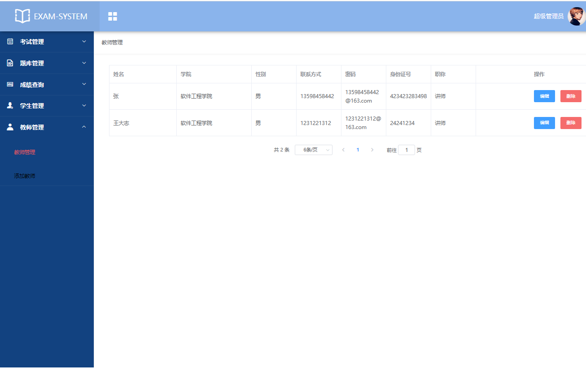
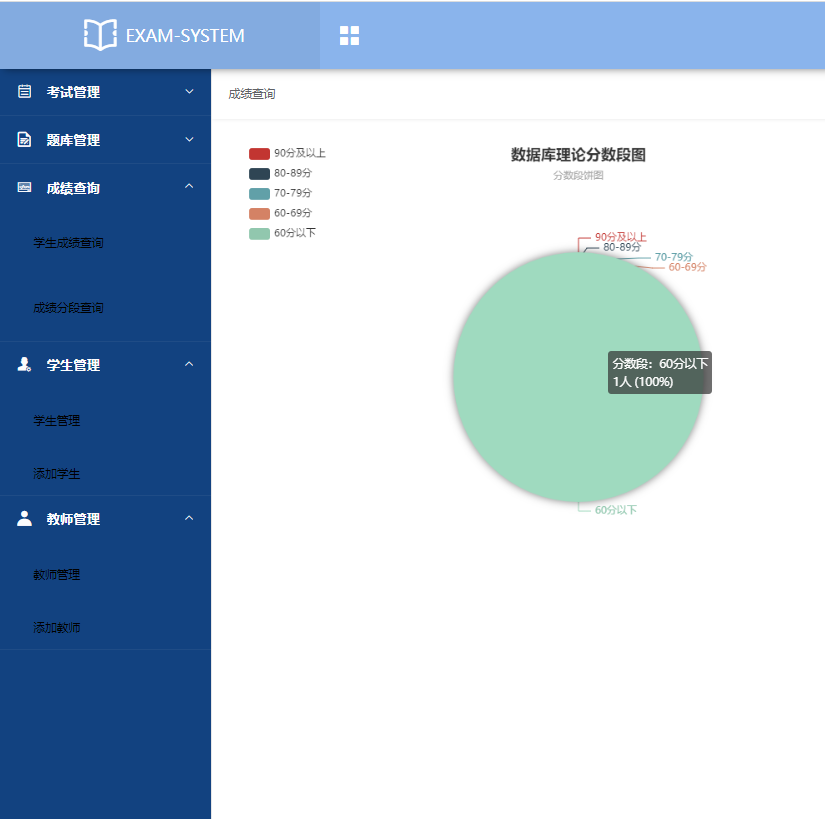

**需要完整代码可以加qq  931708230 或者加微信 ynwwxid**

**需要完整代码可以加qq  931708230 或者加微信  ynwwxid**

#在线考试系统 #java web #java #毕业设计  #springboot #课程设计 #编程 #vue #mybatis #源代码 #ssm

## Spring Boot  在线考试系统

* ## 系统介绍
该项目是一个前后端分离项目，后端使用 SpringBoot，前端使用 VUE 和 Element-UI 组件库配合完成开发。

学生：我的试卷、我的练习、我的成绩、修改密码

教师：学生管理、试卷管理、题库管理、成绩查询

管理员：学生管理、试卷管理、题库管理、成绩查询、教师管理

* ## 浏览地址
http://localhost:8088/  
  
管理员账号：9527
教师账号：20081001
学生账号：20154084
密码都是：123456

* ## 页面截图

  

  

  

  

  

  

  

  

  

  
### 基础环境 :IDEA/eclipse，maven3.x，JDK 1.8 ， Mysql 5.7，node.js

### 源码+数据库脚本 

所有项目以及源代码本人均调试运行无问题 可支持远程调试运行
	
**需要完整代码可以加qq  931708230 或者加微信 ynwwxid**

**需要完整代码可以加qq  931708230 或者加微信  ynwwxid**